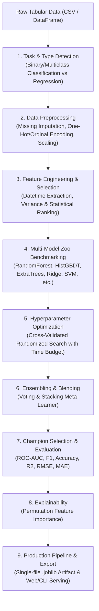

# 🚀 AutoML Framework Implementation (INTERN ID - CITS9171)

An end-to-end, modular, and production-grade **Automated Machine Learning (AutoML)** framework for tabular datasets in Python.

Built with native scikit-learn compliance, it automates every phase of the data science lifecycle: automatic task detection, data cleaning and imputation, feature engineering, statistical feature selection, multi-algorithm benchmarking, hyperparameter optimization, stacking & voting ensembling, model explainability, production model serialization, and interactive web/CLI interfaces.

---

## 📌 What is AutoML and What Does This Framework Do?

In standard machine learning workflows, data practitioners spend 80% of their time on repetitive and error-prone tasks:
- Inspecting datasets, handling null values, and parsing date/time strings.
- Encoding categorical variables and scaling numerical attributes.
- Selecting predictive features while dropping redundant or constant columns.
- Manually testing different model families (Random Forests, Gradient Boosting, SVMs, Neural Nets).
- Tuning dozens of hyperparameters across candidate algorithms.
- Ensembling multiple models to boost generalization accuracy.
- Packaging the entire transformation pipeline for production inference.

**AutoML Framework** automates this entire pipeline into a clean, unified workflow:
```python
from automl import AutoML

# Load your dataset
X, y = df.drop(columns=["target"]), df["target"]

# One-line automated machine learning
automl = AutoML().fit(X, y)

# Predictions & evaluation
predictions = automl.predict(X_test)
print(automl.leaderboard())
```

---

## 🏗️ Architecture



---

## ✨ Key Features & Components

| Component | Technical Description & Meaning |
| :--- | :--- |
| **Automatic Task Detection** | Inspects target distributions and data types to autonomously classify tasks into **Binary Classification**, **Multiclass Classification**, or **Continuous Regression**. |
| **Intelligent Preprocessing** | Automates missing value imputation (median/mode), categorical encoding (One-Hot for low cardinality, Ordinal for high cardinality), feature scaling (Standard, Robust, MinMax), and redundant column dropping (constants and ID hashes). |
| **Feature Engineering & Selection** | Extracts temporal signals from datetime strings (`_year`, `_month`, `_day`, `_dayofweek`, `_is_weekend`) and uses variance thresholds and ANOVA/F-statistic ranking to select optimal features. |
| **Diverse Model Zoo** | Benchmarks candidates across diverse algorithmic paradigms: Linear/Logistic, Tree Bagging (Random Forest, Extra Trees), Modern Histogram GBDT (`HistGradientBoosting`), Distance-based (KNN), Probabilistic (GaussianNB), Kernel (SVC/SVR), and Neural Baselines (MLP). |
| **Hyperparameter Optimization (HPO)** | Explores parameter spaces with cross-validation and time-budget awareness to prevent timeouts on large datasets. |
| **Ensembling & Blending** | Combines the top-$K$ best performing algorithms into **Voting Ensembles** and **Stacking Ensembles** (with out-of-fold meta-learners) to achieve higher predictive performance. |
| **Leaderboard & Metric Suite** | Tracks and ranks every candidate model by primary metric (`roc_auc`, `f1_weighted`, `accuracy`, `r2`, `rmse`), std error, and fit time. |
| **Global Explainability** | Computes model-agnostic **Permutation Feature Importance** on validation data to reveal the most influential features. |
| **Production Inference Pipeline** | Bundles preprocessing, feature selection, and the trained model into a unified pipeline exportable to `.joblib`. |
| **Dual User Interfaces** | Includes a full **Streamlit Web Studio** (`app.py`) for visual interactive exploration and a fast **CLI** (`cli.py`) for automated batch jobs. |

---

## 📦 Project Structure

```
AutoML_Framework_implementation/
├── automl/                           # Core framework package
│   ├── __init__.py                   # Package exports
│   ├── config.py                     # Configuration dataclasses & budget settings
│   ├── engine.py                     # Unified AutoML, AutoMLClassifier, AutoMLRegressor
│   ├── preprocessing/
│   │   ├── __init__.py
│   │   └── cleaner.py                # Type inference, imputation, encoding, scaling
│   ├── feature_engineering/
│   │   ├── __init__.py
│   │   └── engineer.py               # Feature selection & ranking
│   ├── models/
│   │   ├── __init__.py
│   │   └── registry.py               # Model candidates & hyperparameter spaces
│   ├── optimization/
│   │   ├── __init__.py
│   │   └── tuner.py                  # Cross-validated HPO search engine
│   ├── ensemble/
│   │   ├── __init__.py
│   │   └── stacking.py               # Voting & Stacking ensemble builders
│   ├── evaluation/
│   │   ├── __init__.py
│   │   └── metrics.py                # Evaluation metrics & Leaderboard tracker
│   └── explainability/
│       ├── __init__.py
│       └── importance.py             # Permutation feature importance
├── examples/
│   ├── classification_demo.py        # End-to-end classification demo
│   └── regression_demo.py            # End-to-end regression demo
├── tests/
│   ├── __init__.py
│   └── test_automl.py                # Unit and integration test suite
├── app.py                            # Streamlit interactive web dashboard
├── cli.py                            # Command line training tool
├── requirements.txt                  # Python dependencies
└── README.md                         # Documentation
```

---

## 🚀 Quick Start Guide

### 1. Installation

Clone the repository and install the dependencies:
```bash
git clone https://github.com/kushalinisreeja/AutoML_Framework_implementation.git
cd AutoML_Framework_implementation
pip install -r requirements.txt
```

---

### 2. Python API Usage

#### Classification Example:
```python
import pandas as pd
from sklearn.datasets import load_breast_cancer
from automl import AutoMLClassifier

# Load data
data = load_breast_cancer(as_frame=True)
X, y = data.data, data.target

# Initialize and fit AutoML
clf = AutoMLClassifier(
    time_budget_secs=120,
    n_splits=5,
    ensemble=True,
    verbose=1
)
clf.fit(X, y)

# Print leaderboard
print(clf.leaderboard())

# Make predictions
predictions = clf.predict(X.head())
probabilities = clf.predict_proba(X.head())

# Save production model
clf.save("model.joblib")
```

#### Regression Example:
```python
from sklearn.datasets import fetch_california_housing
from automl import AutoMLRegressor

# Load data
housing = fetch_california_housing(as_frame=True)
X, y = housing.data, housing.target

# Train AutoML Regressor
reg = AutoMLRegressor(
    time_budget_secs=120,
    primary_metric="r2",
    n_splits=5,
    ensemble=True
)
reg.fit(X, y)

# View top feature importances
print(reg.get_feature_importance(top_n=10))
```

---

### 3. Interactive Web Studio (`app.py`)

Launch the visual dashboard in your browser:
```bash
streamlit run app.py
```

**Features in the Web App**:
- 📂 **Dataset Selection**: Upload any CSV or choose from built-in benchmarks (Breast Cancer, Iris, California Housing, Wine).
- 📊 **Exploratory Data Analysis**: Auto-detects data types, missing value heatmaps, and target distributions.
- ⚙️ **Configurable Controls**: Set time budgets, CV folds, optimization trials, and ensembling settings.
- 🏆 **Interactive Leaderboard**: Visual bar charts comparing models with error bars and ensemble badges.
- 🔍 **Model Explainability**: Interactive horizontal bar charts showing top feature importances.
- 💾 **One-Click Download**: Download the trained production pipeline (`.joblib`) with a single click.
- 🔮 **Live Prediction Playground**: Dynamically generates input fields for your dataset to test predictions in real-time.

---

### 4. Command-Line Interface (`cli.py`)

Train and export models directly from your terminal:
```bash
python cli.py --data my_dataset.csv --target target_column --task classification --output best_model.joblib
```

CLI Arguments:
- `--data`: Path to dataset (CSV).
- `--target`: Name of the target column.
- `--task`: `auto`, `classification`, or `regression`.
- `--metric`: Custom optimization metric (`roc_auc`, `f1_weighted`, `accuracy`, `r2`, `rmse`).
- `--time-budget`: Time budget in seconds (default: 180).
- `--folds`: Number of CV folds (default: 5).
- `--trials`: HPO search trials per candidate (default: 6).
- `--no-ensemble`: Disable voting and stacking.
- `--output`: Filepath to save the serialized pipeline.

---

### 5. Running Tests

Run the automated test suite:
```bash
python -m unittest discover -s tests
```

---

## 📄 License
This project is licensed under the MIT License.
